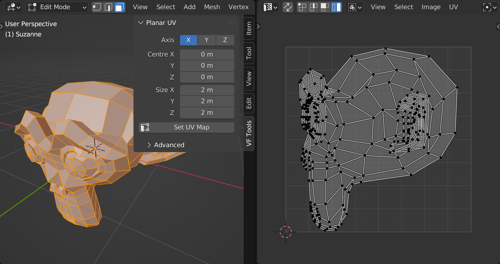

# VF Planar UV

Numerical planar projection of 3D meshes into UV space, allowing for accurate and replicable results instead of relying on Blender's "Project From View" (which is either non-repeatable by default or non-customisable in "orthographic" mode).

## Installation and Usage

- Download [VF_planarUV.py](https://raw.githubusercontent.com/jeinselenVF/VF-BlenderPlanarUV/main/VF_planarUV.py)
- Open Blender Preferences and navigate to the "Add-ons" tab
- Install and enable the Add-on
- It will show up in the 3D view `VF Tools` tab

## Settings

### Main Settings

- `Axis` sets the direction of the planar projection: `X`, `Y`, or `Z`
- `Centre` sets the centre point of the projection space, allowing for any specific location to be mapped
- `Size` defines the scale of the projection, allowing for known numerical translation from object space into UV space
- `Space` sets local or world space for both loading selection settings and generating the UV map

### Advanced Settings

- `Load Selection Settings` calculates the bounding box of all selected vertices and sets the centre and size settings to exactly contain the selection (particularly helpful for mesh elements that aren't centred with the object pivot)
- `Rotation` swizzles the input coordinates to offer 90° variations in mapping orientation (this is akin to rotating a camera capturing the geometry; it efficiently rotates the space the coordinates are loaded in)
- `Flip` takes the resulting UV mapping and flips the U values (this operates before alignment and works reliably with both options below)
- `Alignment` determines how the mesh will be aligned to UV space
  - `Image` is standard UV map usage, where the centre of the defined area will be aligned to 0.5, 0.5 in UV space
  - `Zero` is for situations where standard UV mapping principles may not apply, and the centre of the defined are should align to 0.0, 0.0 in UV space for reliable data storage within a UV map

Note that this add-on operates in _**object space,**_ not _**world space.**_ Planar projection settings `centre` and `size` will not take into account the object's position, rotation, or scale in world space.

This software is provided without guarantee or warranty.